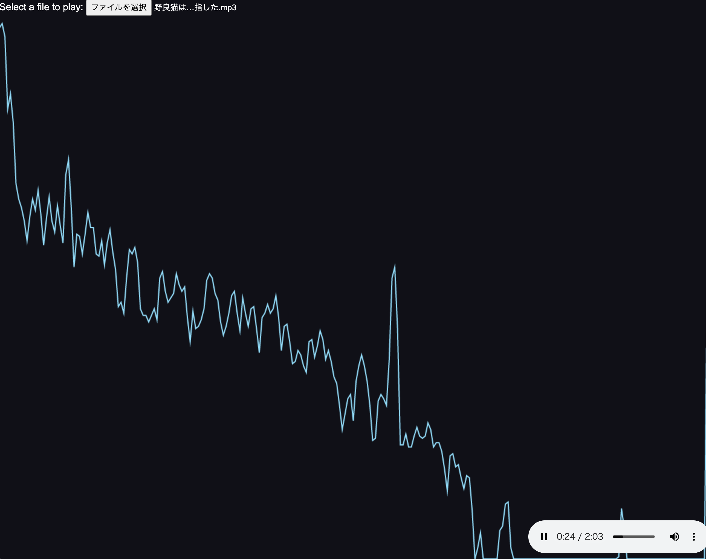

## What is this
Audio spectrum visualizer

### demo
[https://ikmnjrd.github.io/spectrum-visualizer](https://ikmnjrd.github.io/spectrum-visualizer)


### screenshot


### setup
```bash
$ cd ./docs
$ python -m SimpleHTTPServer 8080
```


### 参考にしたサイト
- [https://www.petitmonte.com/javascript/waveform_spectrum.html](https://www.petitmonte.com/javascript/waveform_spectrum.html)
- [とほほのWWW入門](https://www.tohoho-web.com/html/memo/canvas-2d.htm)
- [MDN](https://developer.mozilla.org/ja/docs/Web/API/Web_Audio_API)